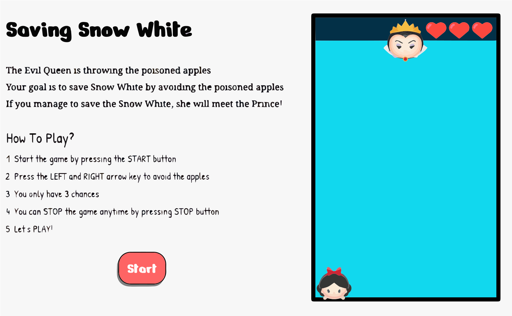

# Game-Project

# Preview:

# Overview:

- Design and Buliding my own game
- Full functioning browser based game using HTML, CSS/SCSS and JavaScript

# Game - Falling Objects Game

- The player need to move left or right to escape from the falling objects.
- The player has 3 chances in a game.
- Game over if player collides with the objects more than 3 times.

# PSEUDOCODE

# HTML/CSS

0. Instruction
1. Screen for Game
2. 1 Player
3. Falling objects
4. 3 chances
5. Game start button

# JS

1. Game starts after button clicked

- Start button to start loading the game
- clicked : Start => Restart

2. Player movement - left and right
   addEventListener to keyboard : left/right arrows
   player only moves along the x-axis

3. Objects movement - random, from top to down
   objects only moves along the y-axis

4. Collisio n - a heart deducted
   if player collides with the objects, a heart will be decducted

5. Game running time: 30 sec

6. Game Over after 3 collisions/ ends
   if no heart left --> Game Over
   if 1 or more than 1 heart left --> You win!

7. If you win , "Congrats" image pop up
   If you lose, "Game Over" alert
